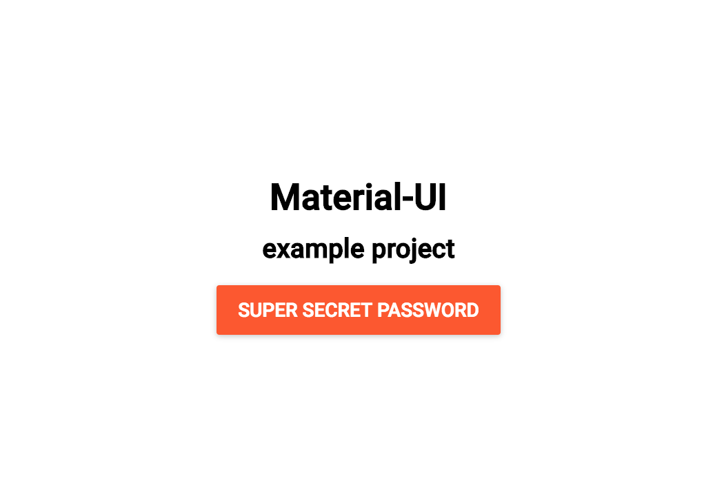

Workshop
==============

### Ph-0 セットアップ

1. [f/w・ライブラリ紹介](#fwライブラリ紹介)
2. [プロジェクトセットアップ・動作確認](#プロジェクトセットアップ動作確認)
3. [Firebaseのセットアップ](0-3_SETUP_FIREBASE.md)

### Ph-1 基本実装

TODOアプリの基本機能でFirebaseの基本的なデータI/O、セキュリティ設定、デプロイ方法を知る

1. [ログイン](1-1_LOGIN.md)
  - Googleアカウントでソーシャルログイン（認証連携）
  - https://speakerdeck.com/heki1224/firebase-authentication
2. [タスク表示・追加・変更・削除](1-2_TASK.md)
3. [完了チェック](1-3_COMPLETE.md)
4. [セキュリティ設定](1-4_SET_SEC.md)
5. [デプロイ](1-5_DEPLOY.md)

---

## f/w・ライブラリ紹介

このプロジェクトで使用しているf/w・ライブラリの紹介

- [Firebase](https://firebase.google.com/?hl=ja)
  - 言わずと知れたBaaS
  - サービスを簡単に呼び出せる各種SDKが提供されている
  - （今回はJavaScript用SDK使用）
- [Material-UI](http://www.material-ui.com)
  - マテリアルデザインのReact実装
- [React](https://facebook.github.io/react/)
  - http://uxmilk.jp/43555

### for development

- webpack
  - JavaScriptのビルドツール
  - 依存関係解決・コンパイル
- webpack-dev-server
  - src変更を検知してブラウザをオートリロードしてくれる
  - webpackの結果をオンメモリで管理、差分のみを反映することで開発を効率化できる
- babel
  - ES2015で書いたJavaScriptをES5で動くコードに変換してくれる（コンパイラー？）

---

## プロジェクトセットアップ・動作確認

1. プロジェクトルートで以下を実行

  npm install
  npm start

2. ブラウザで `http://localhost:3000` へアクセス

↓画面がでたら成功

